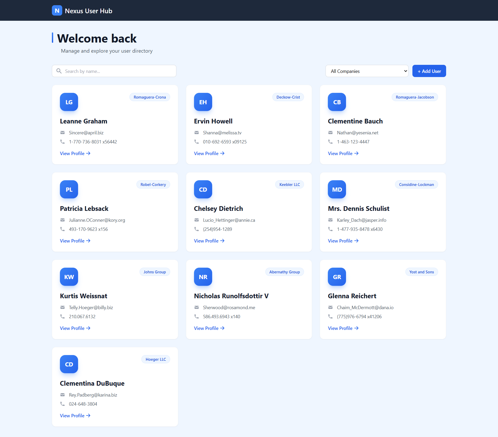
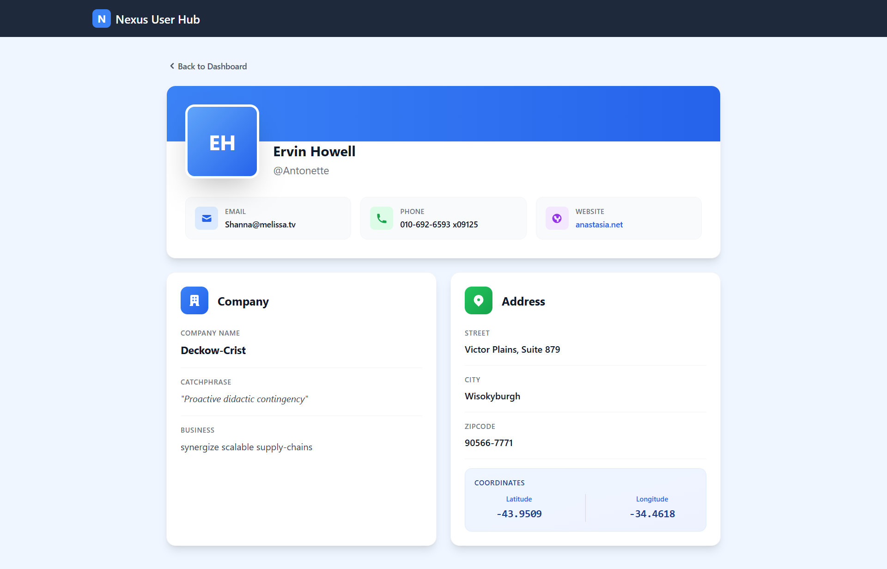
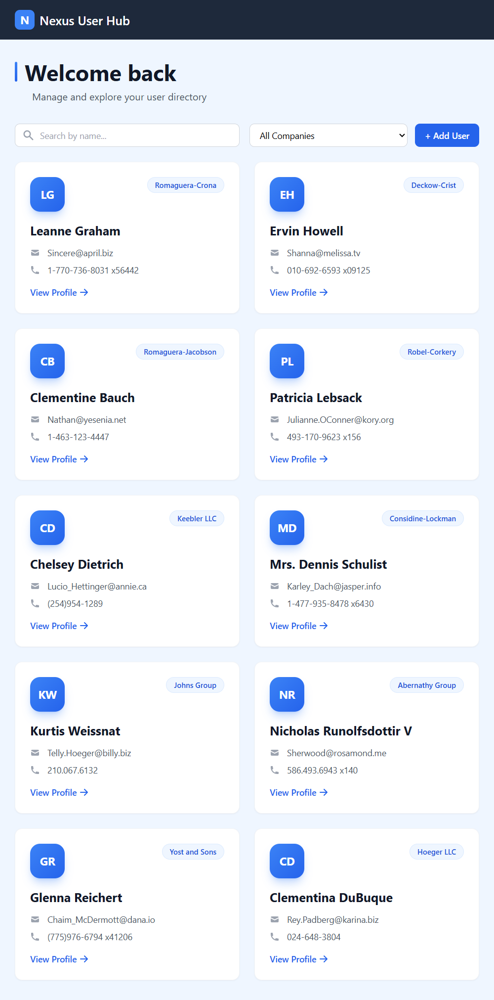
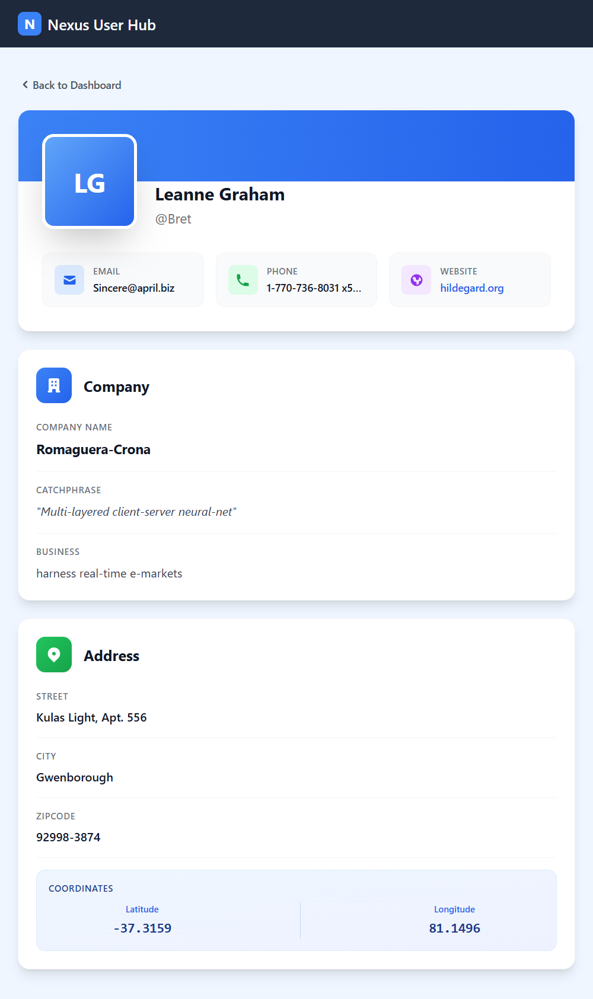
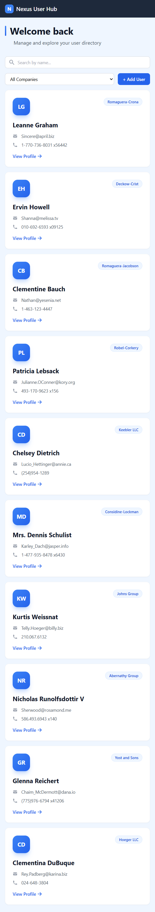
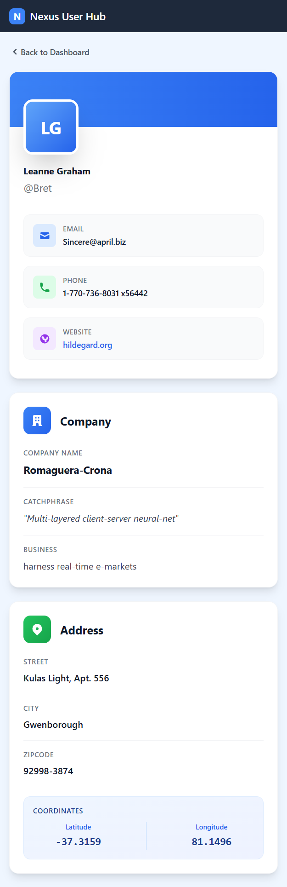

# Nexus User Hub 🚀

## 🌐 Live Demo

**Deployed Link:** [https://nexus-user-hub.netlify.app/](https://nexus-user-hub.netlify.app/)

---

## 📖 About The Project

**Nexus User Hub** is a feature-rich user management dashboard that allows you to browse, search, filter, and manage users with an intuitive and modern interface. The application fetches user data from an external API and provides a seamless experience with real-time search, filtering by company, and detailed user profiles.

---

## ✨ Key Features

### 🏠 Dashboard Page
- **User List Display** - Browse all users in a responsive card-based grid layout
- **Real-time Search** - Search users by name with instant results
- **Clear Search** - Quick clear button to reset search
- **Filter by Company** - Dropdown filter to view users from specific companies
- **Add New User** - Create new users with form validation (client-side)
- **Loading & Error States** - Elegant loading spinner and error messages
- **Empty State** - Friendly message when no results found

### 👤 User Details Page
- **Complete User Profile** - View detailed information about any user
- **Contact Information** - Email, phone, and website with color-coded icons
- **Company Details** - Company name, catchphrase, and business info
- **Address Information** - Full address with geo-coordinates display
- **Back Navigation** - Easy navigation back to dashboard
- **Not Found State** - Handles missing user scenarios gracefully

### 🎨 UI/UX Features
- **Responsive Design** - Fully responsive across desktop, tablet, and mobile
- **Modern Aesthetics** - Gradient overlays, smooth transitions, hover effects
- **Accessibility** - Focus states, keyboard navigation support
- **Clean Typography** - Readable fonts with proper hierarchy
- **Color Palette** - Professional blue-gray theme with accent colors

---

## 🛠️ Tech Stack

### Frontend
- **React 18** - UI library with functional components and hooks
- **Redux Toolkit** - State management (simplified Redux)
- **React Router v6** - Client-side routing and navigation
- **Tailwind CSS** - Utility-first CSS framework
- **React Icons** - Icon library (Hero Icons)

### Build Tools
- **Vite** - Fast build tool and dev server
- **PostCSS** - CSS processing
- **Autoprefixer** - CSS vendor prefixing

### API & Data
- **Axios** - HTTP client for API requests
- **JSONPlaceholder** - Free fake REST API for testing

### Code Architecture
- **Custom Hooks** - Reusable logic (`useFetch`)
- **Utility Functions** - Helper functions for data manipulation
- **Feature-based Structure** - Organized by feature/purpose
- **Component Separation** - Small, focused, reusable components

---

## 📦 Installation & Setup

### Prerequisites
- Node.js (v16 or higher)
- npm or yarn

### Steps

1. **Clone the repository**
   ```bash
   git clone https://github.com/addepalli-bhavana/nexus-user-hub.git
   cd nexus-user-hub
   ```

2. **Install dependencies**
   ```bash
   npm install
   ```

3. **Run development server**
   ```bash
   npm run dev
   ```
   The app will be available at `http://localhost:5173`

4. **Build for production**
   ```bash
   npm run build
   ```

5. **Preview production build**
   ```bash
   npm run preview
   ```

---
## 🎨 Screenshots

### Dashboard View



### User Details



### Dashboard View in Tab



### User Details in Tab


### Dashboard View in Mobile



### User Details in Mobile


---
## 📁 Project Structure

```
nexus-user-hub/
├── public/                      # Static assets
├── src/
│   ├── components/              # React components organized by feature
│   │   ├── common/              # Shared components
│   │   │   ├── LoadingState.jsx
│   │   │   ├── ErrorState.jsx
│   │   │   ├── EmptyState.jsx
│   │   │   └── UserNotFound.jsx
│   │   ├── layout/              # Layout components
│   │   │   ├── Navbar.jsx
│   │   │   └── BackButton.jsx
│   │   ├── dashboard/           # Dashboard-specific components
│   │   │   ├── DashboardHeader.jsx
│   │   │   ├── DashboardControls.jsx
│   │   │   └── UserGrid.jsx
│   │   ├── user/                # User-related components
│   │   │   ├── UserCard.jsx
│   │   │   ├── ProfileHeader.jsx
│   │   │   ├── CompanyCard.jsx
│   │   │   ├── AddressCard.jsx
│   │   │   └── CreateUserModal.jsx
│   │   └── ui/                  # Reusable UI elements
│   │       ├── SearchBar.jsx
│   │       └── FilterDropdown.jsx
│   ├── pages/                   # Page components
│   │   ├── Dashboard.jsx
│   │   └── UserDetails.jsx
│   ├── redux/                   # Redux store and slices
│   │   ├── store.js
│   │   └── usersSlice.js
│   ├── hooks/                   # Custom React hooks
│   │   └── useFetch.js
│   ├── handlers/                # Event handler functions
│   │   └── navigationHandlers.js
│   ├── utils/                   # Utility/helper functions
│   │   └── helpers.js
│   ├── services/                # API service layer
│   │   └── api.js
│   ├── App.jsx                  # Root component
│   ├── main.jsx                 # App entry point
│   └── index.css                # Global styles
├── index.html
├── package.json
├── vite.config.js
├── tailwind.config.js
├── postcss.config.js
└── README.md
```

### 📂 Folder Breakdown

#### **components/common/**
Shared components used across multiple features:
- **LoadingState** - Full page loading state with spinner
- **ErrorState** - Full page error display
- **EmptyState** - No results message
- **UserNotFound** - User not found page

#### **components/layout/**
Components related to page layout and navigation:
- **Navbar** - Top navigation bar
- **BackButton** - Reusable back button with icon

#### **components/dashboard/**
Dashboard-specific components:
- **DashboardHeader** - Welcome section with title
- **DashboardControls** - Search, filter, and add user button
- **UserGrid** - User cards grid display

#### **components/user/**
User-related components:
- **UserCard** - User card in grid with hover effects
- **ProfileHeader** - User profile header with avatar
- **CompanyCard** - Company information card
- **AddressCard** - Address and location card
- **CreateUserModal** - Modal form for creating users

#### **components/ui/**
Reusable UI input components:
- **SearchBar** - Search input with clear button
- **FilterDropdown** - Company filter dropdown

#### **handlers/**
Event handler functions separated from components:
- **navigationHandlers.js** - Navigation/routing handlers

#### **hooks/**
Custom React hooks:
- **useFetch** - Generic hook for fetching data from API and dispatching to Redux

#### **utils/**
Utility/helper functions:
- **helpers.js** - Data transformation and filtering logic
  - `getInitials(name)` - Extract user initials
  - `getUniqueCompanies(users)` - Get sorted unique company list
  - `filterUsers(users, searchTerm, selectedCompany)` - Filter users
  - `generateUserId()` - Generate unique ID for new users

---
